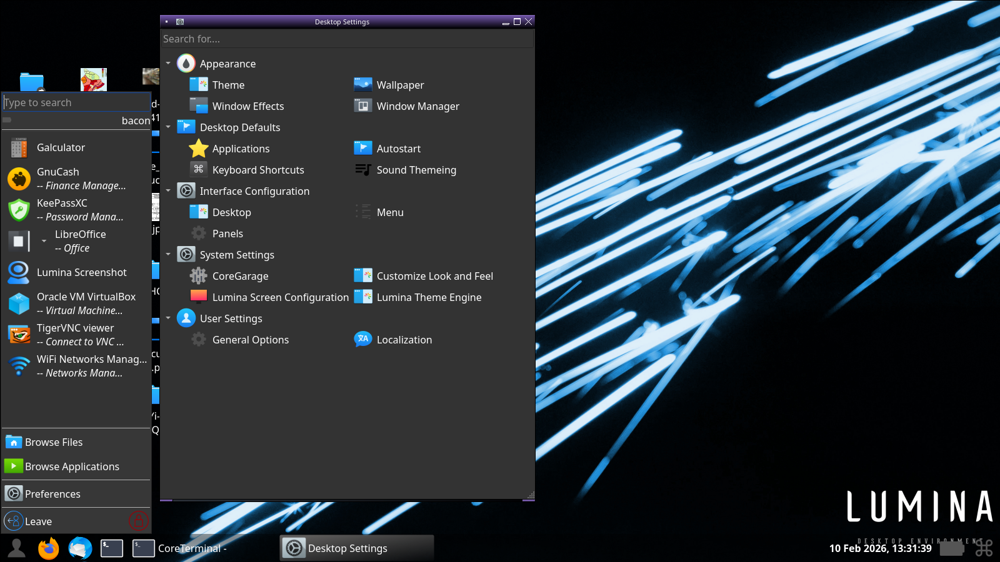
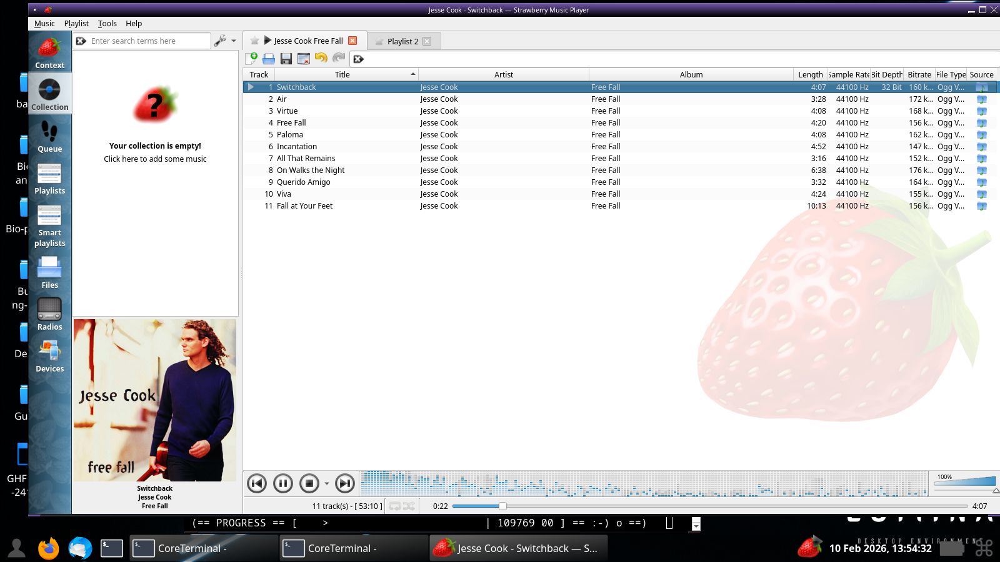
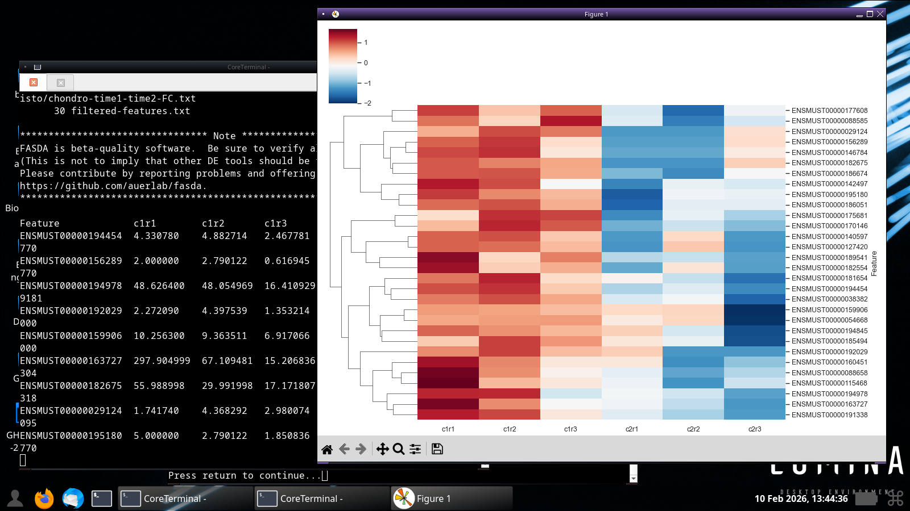
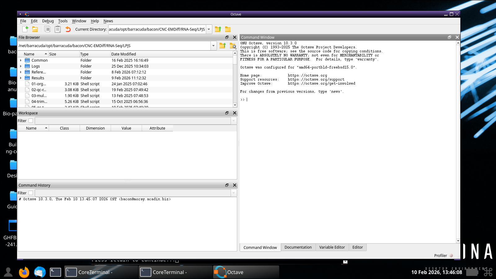
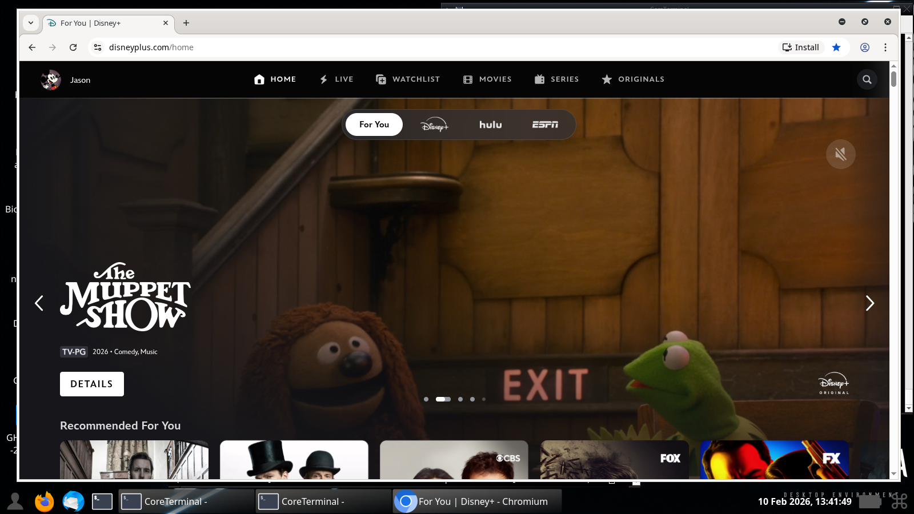

# desktop-installer

## Background

The purpose of desktop-installer is to help you quickly and
easily set up the most reliable and secure desktop system available,
so you can spend your time on creative work rather than repetitive
and tedious systems management.

FreeBSD, NetBSD, and OpenBSD are highly-evolved, free operating systems,
that provide all the features necessary to make a great desktop system for
WEB browsing, editing documents, playing music and videos, developing
software, and much more.  They also offers solid support for most popular PC
hardware.

However, fully configuring a stock BSD desktop system by hand
is a bit like assembling a 1,000-piece jigsaw puzzle.  It's a great thing
to do once for the learning experience, but beyond that, it's probably
not a good use of your valuable time.

There is much more to configuring a complete desktop system than
installing a desktop environment.
There are many important issues that new BSD users are unlikely to know
about, such as ensuring that your ports/pkgsrc tree and packages are
in sync, how to correctly configure device daemons, D-Bus for process
communication, sound and graphics drivers, to name a few.

## What it is

Desktop-installer is a post-install script that embodies the extensive
knowledge needed to configure a clean, reliable BSD desktop system.
It automates
the process of configuring a BSD workstation or laptop computer, allowing
typical users to set up a fully functional desktop environment in
about 15 minutes on modern hardware with a fast Internet connection.

The end result is a fully functional graphical environment comparable
to GUI-based systems such as GhostBSD, or Debian or Ubuntu GNU/Linux.
However, unlike those systems, desktop-installer
supports *every* desktop environment or window manager provided by the
native package manager, *every* supported version of the operating system,
and *every* hardware platform supported by the operating system.

The most popular desktop environments and window managers are
explicitly supported, and any other can be configured with relative ease
using the "Custom" menu option.

Desktop-installer installs and configures desktop-independent tools
and features, such as
[QMediaManager](https://github.com/outpaddling/qmediamanager).

The [VirtualBox](https://virtualbox.org) guest
environment is automatically detected and configured with the VirtualBox
guest additions on FreeBSD, so you can easily try out desktop-installer
even if you don't have a spare PC.  On other BSDs that do not have
guest additions, we recommend configuring the VirtualBox to use the
USB Tablet as its pointing device.  This at least provides seamless
mouse integration with the host.

Parallels and VMWare Fusion are also
automatically detected and configured with a basic graphics setup
on FreeBSD.  Hyper V
can also run FreeBSD, but in our experience it is slow and unreliable.
Windows users are advised to install VirtualBox instead.  Note that Hyper V
should be disabled via Control Panel if you are running a different
virtualization system.

Desktop-installer is strictly a configuration tool, i.e. a convenient user
interface for integrating standard BSD tools and ports/packages. Unlike most
desktop distributions built on FreeBSD and Linux, desktop-installer does not
duplicate components of or add components to the base system. Our goal is to
work with the underlying operating system, not around it, integrating the many
features already provided by BSDs to create a fast, stable, and secure
desktop experience.

## Uses

BSD operating systems are fabulous for running open source software, due
to their unparalleled reliability and security, and convenient software
management.
FreeBSD, in particular, has the second largest curated package collection
(called FreeBSD ports) of any operating system, not too far behind Debian
packages.  Furthermore, FreeBSD ports tend to be more up-to-date,
as tracked by [https://repology.org/](https://repology.org/).  BSD
systems + open source software provide everything most people need for
their daily computer use, including office suites, multimedia, scientific
computer, and much more.  You have your choice of dozens of desktop
environments to choose from.

The Lumina desktop environment, one of dozens of choices:



Manage your music with Strawberry, one of over 800 audio packages in
the FreeBSD ports system:



BSD is great for science and engineering, as well, with over 2,400 packages
in the math and science categories of FreeBSD ports:




On FreeBSD, at least, it's easy to set up the chromium browser for
streaming proprietary content from services like Disney, Hulu,
Netflix (which also runs FreeBSD on their content delivery network),
Paramount, etc.



Not much commercial software is intended to run directly on BSD systems,
but BSD systems support numerous high-quality, free virtual machine
monitors, so Windows or other systems can be run as a guest under BSD
or vice-versa.
Some software can also be run directly under BSD using the Linux
compatibility module or the Wine Windows API emulator.

## Why post-install?

Desktop-installer is implemented as a post-install script, rather than
integrated into the OS installer for the following reasons:

1. The BSD installers work fine, and are very fast.  With a little
   practice, a basic BSD system can be installed in under five minutes.
   
2. Many server systems need not and should not have a graphical
   user interface.  Adding one would would be of little use in a
   data center, and would just mean a lot more packages to upgrade
   during normal maintenance.  This would be a waste of time and
   bandwidth.
   
3. As a post-install script, you can simply run desktop-installer again
   if you want to try a different desktop environment.  The rest of
   your system can remain unaffected, and need not even be rebooted
   in most cases.

## Audience

FreeBSD, NetBSD, and OpenBSD are operating systems primarily
used by somewhat advanced Unix users such as professional software
developers and systems managers.  They are used in many hard-core
behind-the-scenes settings, such as the Netflix content delivery network,
many popular storage and networking appliances, etc.  They can, however,
also make a great desktop system for typical daily computing, such as
web browsing, document editing, gaming, etc.

Desktop installer is fairly quick and easy to use, but it does require
a little bit of Unix command-line knowledge.  If you're new to Unix,
but somewhat computer-savvy, you should have no trouble using desktop-installer.
If you prefer to start with the easiest path to seeing what Unix is
about, you may want to first try a system with a simple graphical
installer first, such as [GhostBSD](https://ghostbsd.org) or
[Debian GNU/Linux](https://debian.org).

For more information, see http://acadix.biz/desktop-installer.php.

## Design principles

Desktop-installer is strictly a configuration tool, i.e. a convenient user
interface for integrating standard BSD tools and ports/packages. Unlike most
desktop distributions built on FreeBSD and Linux, desktop-installer does not
duplicate components of or add components to the base system. Our goal is to
work with the underlying operating system, not around it, integrating the many
features already provided by BSDs to create a fast, stable, and secure
desktop experience.

Any general enhancements for the sake of desktop-installer
will be desktop-independent and available via the ports/pkgsrc
collection for use with or without desktop-installer.

One of the primary objectives
of desktop-installer is long-term sustainability.  Since man-hours are costly,
efforts are focused on
improving the functionality of the end-result, not the appearance of the tool.

Desktop-installer does not try to compensate for FreeBSD's shortcomings.
We prefer to leave them exposed so that there is motivation to fix them in
the FreeBSD base or ports system.

Desktop-installer will not impose any arbitrary limitations.
While the GUI distributions tend to support only AMD64 systems running the
latest FreeBSD release, desktop-installer allows you to use any supported
version of BSD on any supported CPU architecture.  ARM, PowerPC,
RISC-V and Sparc are treated no differently than x86.  Desktop-installer has
been tested on an iMac G5 and a Rock 64, in addition to numerous x86 PCs and
laptops.  While we can't guarantee that all
ports/packages will work on all platforms, desktop-installer
won't stand in your way.

## Using desktop-installer

FreeBSD supports two major releases at any given time, e.g. 13.x and 14.x.
We strongly recommend using the latest major FreeBSD release for desktop
systems.  Legacy releases may be preferred for certain server applications,
but they may not have the latest device drivers and base libraries needed
for some desktop applications.

First perform a basic BSD installation by booting from an install
CD, DVD, or USB drive.  The standard BSD installers are relatively
easy to use and flexible enough for most installations.  Use one of the
install images at
<a href="https://ftp.freebsd.org/pub/FreeBSD/releases/ISO-IMAGES/">https://ftp.freebsd.org/pub/FreeBSD/releases/ISO-IMAGES/</a>,
<a href="https://netbsd.org/">https://netbsd.org/</a>, or
<a href="https://www.openbsd.org/faq/faq4.html#Download">https://www.openbsd.org/faq/faq4.html#Download</a>
or one of the mirror sites.

To install from a USB stick, download the a ".img" image file and
image the USB drive with it.  Under Windows, you can use a tool such as
Rufus.  On Unix systems (including macOS), you can use the dd command.
Replace "file.img" with the name of the file you downloaded and
"/dev/da0" with the name of the device that appears in /dev when you plug in
a USB stick.

```
dd if=file.img of=/dev/da0 bs=64k conv=sync
```

If installing from a CD/DVD drive or installing on a virtual machine,
download a .iso image.  Use CD/DVD burning software to burn a disc for
real hardware, or just load the .iso into the virtual CD/DVD drive in
the virtual machine.  A -disc1.iso file is a generally a good choice.
The -disc1.iso.xz files will download faster and can be uncompressed
with "unxz" if you have it.  Choose "amd64" for an x86-based PC, or
"aarch64" for a VM on ARM-based Macs.

Boot from the USB stick or CD/DVD drive and follow the instructions on
the screen to install your BSD base system.
This can usually be completed in a few minutes
by experienced users, but your first time through, you should take your
time and read all instructions carefully.

If installing under VirtualBox, we DO NOT recommend using the VM images
provided by FreeBSD.  A fresh install from the disc1 ISO image can be
completed in under 5 minutes, so a preconfigured VM image doesn't offer much
convenience.  A fresh install also allows you to configure your VM settings,
disk size, and base FreeBSD installation as you want, instead of figuring out
how to modify the preconfigured VM image afterward.

Also important for VirtualBox: Use the vboxsvga virtual GPU rather than
vmsvga for FreeBSD.  At the time of this writing, it works better with
VirtualBox guest additions for features such as automatic screen resize.

System clocks may be set to local time or UTC (GMT).
Make sure the virtual machine and host are in agreement on this.
VirtualBox has a check box in system settings for
systems with the clock set to UTC.

Lastly, adjusting the boot order of the VM will make the guest OS
installation a bit smoother.  Configure the VM to boot from hard
disk first, then optical disk (you will use a .iso file for install).
The VM will then boot from the .iso image during install (since
there is no operating system on the hard disk yet), and from
the virtual hard disk after install.

If you have a high-end machine with 4 or more GiB of RAM, you may want to
try booting FreeBSD from ZFS.  BSDinstall makes booting from ZFS easy whether
you are using a single disk, a mirror, or a RAID-Z array with multiple disks.

For low-end machines with less than 4 GiB of RAM, UFS2, with its small memory
footprint, may provide better overall performance.
UFS2 is a highly underrated file system offering great performance,
reliability, and features,
so don't think you're missing out by not using ZFS.  In fact, Netflix
uses UFS2 to deliver content from its CDN.  ZFS is most
beneficial to high-end storage servers and usually not much of an advantage
on the average laptop or desktop machine.

FreeBSD's BSDInstall is menu-driven and fairly self-explanatory if you
take default options, but if you want to customize your installation or if
you're new to operating system installations and want detailed instructions,
you can find them in the
<a href="https://www.freebsd.org/doc/en_US.ISO8859-1/books/handbook/bsdinstall-start.html">FreeBSD Handbook</a>.
Below are some basic pointers to get you through without all the gory
details.

If installing under VirtualBox:

    -   Select the VBoxSVGA video adapter
    -   Load the FreeBSD disc1 or other ISO file into the virtual CDROM
    -   1G RAM is sufficient
    
FreeBSD install:

    1.  Accept default answers to most questions.
    
    1.  A few pointers:
	-   Hostname:
	    Full hostname, e.g. freebsd13.local, freebsd13.my.domain
	    
	-   System components:
	    Don't bother with ports, will install later
	    Installing src now will save a little time
	    
	-   Filesystem:
	    Auto (UFS) for most installs, ZFS for high-end systems
	    Entire disk, GPT for most systems
	    
	-   If installing on real hardware:
	    Enable powerd
    
	-   Whether real hardware or virtual machine:
	    Enable moused (solves problems with various mouse drivers)
	    Enable ntpdate, ntpd, clear_tmp
	
	-   Add users: no (auto-admin does this better)
    
	-   If installing under VirtualBox:
	    It's hard to eject CD fast enough after Reboot
	    Use ACPI shutdown in Machine menu instead, then eject virtual CD

After completing the installation and rebooting, log in as root
and install the desktop-installer port or package:

```
FreeBSD: pkg install -y desktop-installer
NetBSD: pkgin -y install desktop-installer
```

On OpenBSD, desktop-installer is currently available as a WIP package at
<a href="https://github.com/jasperla/openbsd-wip">https://github.com/jasperla/openbsd-wip</a>.

Run desktop-installer as the root user and follow the instructions on the
screen.

Note that desktop-installer will halt on most errors.  This is
fairly rare, but it can happen.  Broken ports/packages are the most common
cause of this.  If you run into any problems while running desktop-installer,
resolve the problem manually, and simply run desktop-installer again.  It
will remember your previous answers, so you can quickly get back to where you
left off.

## Maintaining your Desktop System

Many common tasks, including some described below, can be performed via
the [Auto-admin](https://github.com/outpaddling/auto-admin/) menu.
Simply run "auto-admin" and select an option.

Subscribe to the [FreeBSD security notifications list](https://lists.freebsd.org/mailman/listinfo/freebsd-security-notifications).
 This is a spam-free, very low-volume
email list to notify users about important security updates for FreeBSD.
Typically a small group of security fixes are announced once every few
months.

Update your system frequently using "auto-admin"

Also, we don't recommend overusing upgrade tools on any operating system.
It is best to periodically back up your files and do a fresh install,
in order to clean up any corruption that has accumulated due to
user error, improper shutdowns, and bit rot.

Most software on FreeBSD systems is installed from the FreeBSD ports
collection.  The ports system allows you to quickly install pre-built
binary packages, or just as easily (but slowly) build from source with
alternative
build options such as additional compiler optimizations or optional
features.  FreeBSD's ability to automatically install from source also
you to cleanly and easily install software whose license forbids
redistribution as a binary package.

FreeBSD has strong default security settings and is immune to most malware,
but even a technically secure system is only as safe as your own habits.
<a href="password.php">Secure your password</a> and change it
frequently.
Be careful about running arbitrary software downloaded from the web
or from a USB stick.
Installing all of your software via FreeBSD ports adds a strong layer of
security, but not a guarantee.

Back up your important files regularly, preferably off-site.  It's easy
to do using rsync
or one of the backup tools available in the FreeBSD ports collection.
If your disk fails, just install a new disk, quickly rebuild your system
using desktop installer again, and restore your files.

Use the auto-admin menu to manage user accounts.  Be sure to add new users
to the "wheel" group to allow "su" to root, the "operator" group to allow
use of "shutdown", and the "video" group to ensure optimal graphics
performance.

## Quickstart for the Unix-savvy

1. Perform a minimal FreeBSD, NetBSD, or OpenBSD installation using the
   standard installer
2. Install the desktop-installer package:

    FreeBSD: pkg install desktop-installer
    
    NetBSD: pkgin install desktop-installer
    
    OpenBSD: Package currently under development in the
	     [OpenBSD ports WIP](https://github.com/jasperla/openbsd-wip)
	     collection.

3.  Run "desktop-installer"
4.  Carefully read and follow the instructions on the screen

## History

Desktop-installer began as a simple script to automate the setup of
a blank FreeBSD system with XFCE desktop.  However, I quickly realized
that about 95% of the code had nothing to do with XFCE and applied to
any desktop environment (DE), so I soon added a menu and separate shell
functions for additional DEs.  Desktop-installer has since evolved into
highly a sophisticated script that configures many core components of
BSD systems to produce a full-featured, stable, and secure desktop
system.
